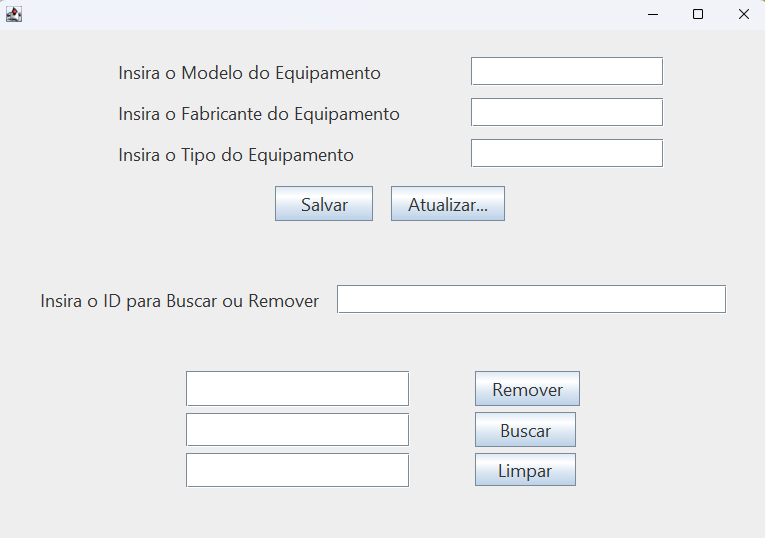
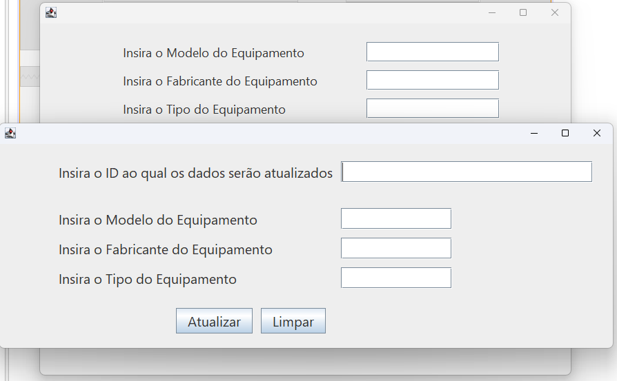
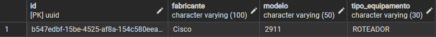

# IT Equipment Manager 🖥️💼

O **IT Equipment Manager** é um sistema Desktop desenvolvido para realizar o gerenciamento completo (CRUD) de equipamentos de TI. O grande diferencial deste projeto está na sua arquitetura híbrida: ele utiliza uma interface gráfica nativa para Desktop com **Java Swing (JFrame)**, mas delega toda a camada de persistência e gerenciamento de banco de dados para o ecossistema do **Spring Boot com Spring Data JPA**.

Este projeto foi construído inicialmente utilizando o IntelliJ IDEA e posteriormente refinado e organizado utilizando o NetBeans.

---

## 🚀 Tecnologias Utilizadas

* **Java 21** 
* **Java Swing (JFrame):** Para a construção da interface gráfica do usuário.
* **Spring Boot:** Framework base para a inversão de controle e injeção de dependências.
* **Spring Data JPA / Hibernate:** Para o mapeamento objeto-relacional (ORM) e abstração das consultas ao banco de dados.
* **PostgreSQL:** Banco de dados relacional robusto para o armazenamento dos dados.
* **Maven:** Gerenciador de dependências e automação do build.

---

## 🔒 Nota sobre Segurança e Boas Práticas (Credenciais do Banco)

Como este é um projeto focado em **portfólio e aprendizado**, as configurações de acesso ao banco de dados no arquivo `application.yml` foram mantidas intencionalmente com os valores padrão do PostgreSQL (`user: postgres` / `password: postgres`).

O objetivo desta abordagem é tornar o projeto **"Plug and Play"**, permitindo que seja possível clonar e rodar a aplicação localmente de forma imediata, sem a necessidade de criar configurações complexas de ambiente.

### 🌐 No Cenário Real
Tenho total ciência de que expor credenciais de acesso em repositórios públicos é uma prática inaceitável em ambientes comerciais e produtivos. Em um cenário real de mercado, a segurança seria garantida através de:

1. **Variáveis de Ambiente:** Substituição das senhas explícitas por referências dinâmicas no Spring Boot (ex: `${DB_PASSWORD}`), injetadas diretamente pelo servidor de hospedagem ou container (Docker/Kubernetes).
2. **Gerenciadores de Secrets:** Utilização de ferramentas robustas de cofres de senhas, como *HashiCorp Vault*, *AWS Secrets Manager* ou *Azure Key Vault*.
3. **Arquivo `.gitignore`:** Isolamento de qualquer arquivo com dados sensíveis de produção para que nunca fossem rastreados pelo Git.

---

# 🛠️ Como Executar o Projeto Localmente

Siga o passo a passo abaixo para rodar a aplicação na sua máquina de forma rápida e prática.

## Pré-requisitos

- **Java 21 (LTS)** — versão utilizada no desenvolvimento e compilação do projeto.
- **PostgreSQL** — instalado e em execução.
- **IDE** — **NetBeans**.

## Passo 1: Clonar o repositório

Abra o terminal do seu sistema operacional e clone o projeto com o comando abaixo:

```bash
git clone https://github.com/joaofranciscoms/it-equipment-manager.git
```

Depois disso, acesse a pasta do projeto:

```bash
cd it-equipment-manager
```

## Passo 2: Configurar o banco de dados

Antes de executar a aplicação, o banco de dados precisa estar criado.

1. Abra o gerenciador do PostgreSQL, como o **pgAdmin**, ou use o terminal do Postgres.
2. Conecte-se com as credenciais padrão do instalador:
   - **Usuário:** `postgres`
   - **Senha:** `postgres`
3. Crie um banco de dados **vazio** com o nome exato:

```text
it-equipment-manager
```

### Atenção ao Owner

Na tela de criação do banco, selecione o **Owner** como o usuário padrão `postgres`.  
Isso garante que a aplicação tenha permissão para ler, gravar e alterar os dados.

### Observação importante

O Hibernate está configurado no arquivo `application.yml` com a propriedade:

```yaml
ddl-auto: update
```

Isso significa que, ao iniciar o projeto, as tabelas, colunas e restrições serão criadas automaticamente.

## Passo 3: Executar a aplicação na IDE

Com o banco de dados criado, você já pode abrir e rodar o projeto.

### No NetBeans

1. Vá em **File > Open Project**.
2. Selecione a pasta do projeto.
3. Aguarde o Maven baixar as dependências automaticamente.

### Iniciar a aplicação

1. Localize a classe principal da aplicação, aquela que contém o método `main` e a anotação `@SpringBootApplication`.
2. Clique com o botão direito nela e selecione **Run**.
3. Você também pode clicar no botão de **Play** na barra superior da IDE.

## Passo 4: Interagir com o sistema

Assim que o Spring Boot terminar de iniciar com sucesso no console da IDE, a janela nativa do Java Swing (`JFrame`) será aberta automaticamente.

A partir desse momento, você já pode utilizar o sistema para:

- cadastrar equipamentos;
- listar registros;
- excluir equipamentos;



- atualizar informações;



- acompanhar as mudanças no banco de dados.



## Estrutura esperada do ambiente

- Banco de dados PostgreSQL ativo.
- Banco `it-equipment-manager` criado.
- Projeto aberto corretamente na IDE.
- Dependências do Maven baixadas.
- Aplicação iniciada sem erros.

## Problemas comuns

Se a aplicação não iniciar, verifique:

- se o PostgreSQL está em execução;
- se o banco `it-equipment-manager` foi criado corretamente;
- se o usuário `postgres` e a senha estão corretos;
- se a porta do PostgreSQL está disponível;
- se o `application.yml` está apontando para o banco correto.

---

## 🗂️ Padronização e Regras de Negócio (Enum)

Para garantir a integridade dos dados e evitar cadastros incorretos, o campo **Tipo de Equipamento** é estritamente controlado por uma `Enum` (`TipoEquipamento`) no Java. Isso significa que o sistema só aceita e armazena os seguintes tipos homologados de hardware e rede:

* 🖥️ **DESKTOP**
* 💻 **NOTEBOOK**
* ⚙️ **WORKSTATION**
* 🔌 **SWITCH**
* 🌐 **ROTEADOR**
* 📡 **ACCESS_POINT**
* 🛡️ **FIREWALL**

> 💡 **Nota Técnica:** No banco de dados PostgreSQL, o Spring Data JPA está configurado para salvar essas opções como texto (`EnumType.STRING`), garantindo que o banco fique legível e de fácil manutenção.

## 🏗️ Boas Práticas e Padrões de Projeto (Destaque Técnico)

Para garantir que a aplicação seja robusta, escalável e segura contra falhas em tempo de execução, foram aplicados conceitos avançados de arquitetura de software:

### 1. Padrão de Projeto Singleton (Gerenciamento de Instâncias)
* **Como foi usado:** O ecossistema do **Spring Boot** foi integrado à interface Swing para gerenciar o ciclo de vida das classes de serviço (`@Service`) e repositórios (`@Repository`).
* **Benefício:** Por padrão, o Spring gerencia esses componentes como **Singletons** (instância única na memória). Isso evita a criação redundante de objetos e conexões com o banco de dados a cada clique de botão no `JFrame`, otimizando o uso de memória e a performance da aplicação Desktop.

### 2. Tratamento Resiliente de Exceções (Exception Handling)
A camada de interface gráfica interage diretamente com as regras de negócio através de blocos `try-catch` altamente especializados. Em vez de deixar a aplicação travar ou exibir mensagens genéricas, o sistema intercepta erros específicos e fornece feedbacks claros ao usuário via `JOptionPane`:

* **`IllegalArgumentException`:** Capturado caso o usuário digite um valor que não corresponda às opções da `Enum` de tipos de equipamento, exibindo uma mensagem amigável de "Tipo de equipamento inválido!".
* **`NoSuchElementException`:** Tratamento focado em operações onde um registro esperado não é localizado no banco.
* **`DataIntegrityViolationException`:** Intercepta falhas de restrição do PostgreSQL (como violações de chaves únicas ou campos obrigatórios vazios), avisando que os dados já existem.
* **`RuntimeException`:** Uma última barreira de proteção que captura qualquer falha inesperada de comunicação com o banco de dados, garantindo que o sistema continue aberto e funcionando mesmo se o banco cair.

---
